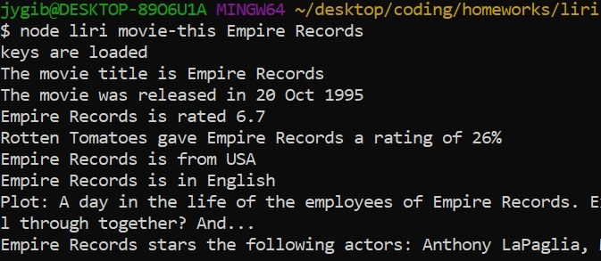

Welcome to Liri-Bot. Liri-Bot responds to several commands as follows:

*Want to know what concerts are coming up for your favorite artist? Type the following into Liri-Bot:*

node liri concert-this artist name

except replace "artist name" with whoever you're searching for! Here's an example:

If the artist has no upcoming shows, the search will return "0"

Otherwise, the Liri-Bot will give you the venue name, city name, and date/time of the concerts!

===================================================================================

*Want to know more information about that song that stuck in your head? Type the following into Liri-Bot:*

node liri spotify-this-song song name

except replace "song name" with the name of the song! Here's an example:

The Liri-Bot will give you the artist, song name, a link to a sample of the song, and the album it's on!

=========================================================

*Want to know more information about your favorite movies? Type the following into Liri-Bot:*

node liri movie-this movie name

except replace "movie name" with the movie title! Here's an example:

The Liri-Bot will give you the title, release year, IMDB and Rotten Tomatoes rating, it's country, the languages it is in, a short plot summary and the actors!

=========================================================

*Not sure what you want? Feeling crazy? Try entering the following into Liri-Bot and see what you get!:*

node liri do-what-it-says

